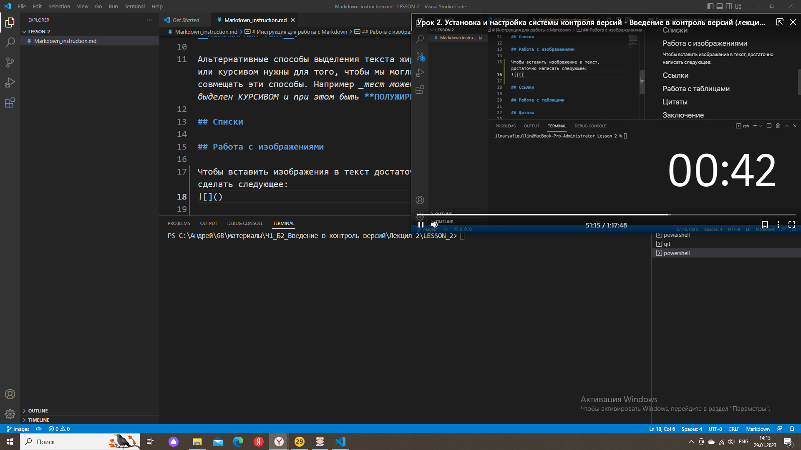

# Инструкция для работы с Markdown

## Выделение текста

Чтобы выделить текст курсивом, необходимо обрамить его звездочками (*) или знаком нижнего подчеркивания (_).
 Например, вот так: *КУРСИВ* или _КУРСИВ_.

Чтобы выделить текст полужирным, необходимо обрамить его двойными звёздочками (**) или знаком двойного нижнего подчеркивания (__).
Например,вот так: **ПОЛУЖИРНЫЙ ТЕКСТ** или __ПОЛУЖИРНЫЙ ТЕКТ__.

Альтернативные способы выделения текста жирным или курсивом нужны для того, чтобы мы могли совмещать эти способы. Например _тест может быть выделен КУРСИВОМ и при этом быть **ПОЛУЖИРНЫМ**_.

## Списки

Чтобы добавить ненумерованные списки, необходимо пункты выделить звёздочкой (*) или знаком +. Например, вот так:
* Элемент 1
* Элемент 2
* Элемент 3
+ Элемент 4

Чтобы добавить нумерованные списки, необходимо пункты просто пронумеровать. Например, вот так:
1. Первый пункт
2. Второй пункт

## Работа с изображениями

Чтобы вставить изображения в текст достаточно сделать следующее:

## Ссылки

## Работа с таблицами

## Цитаты

## Заключение